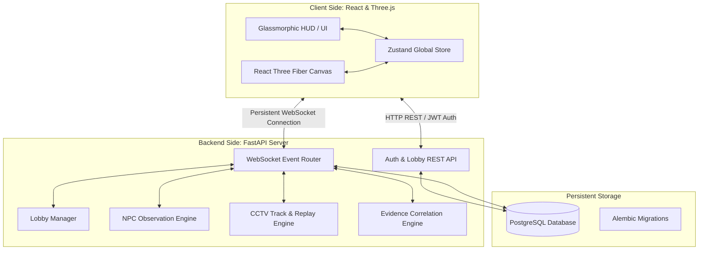
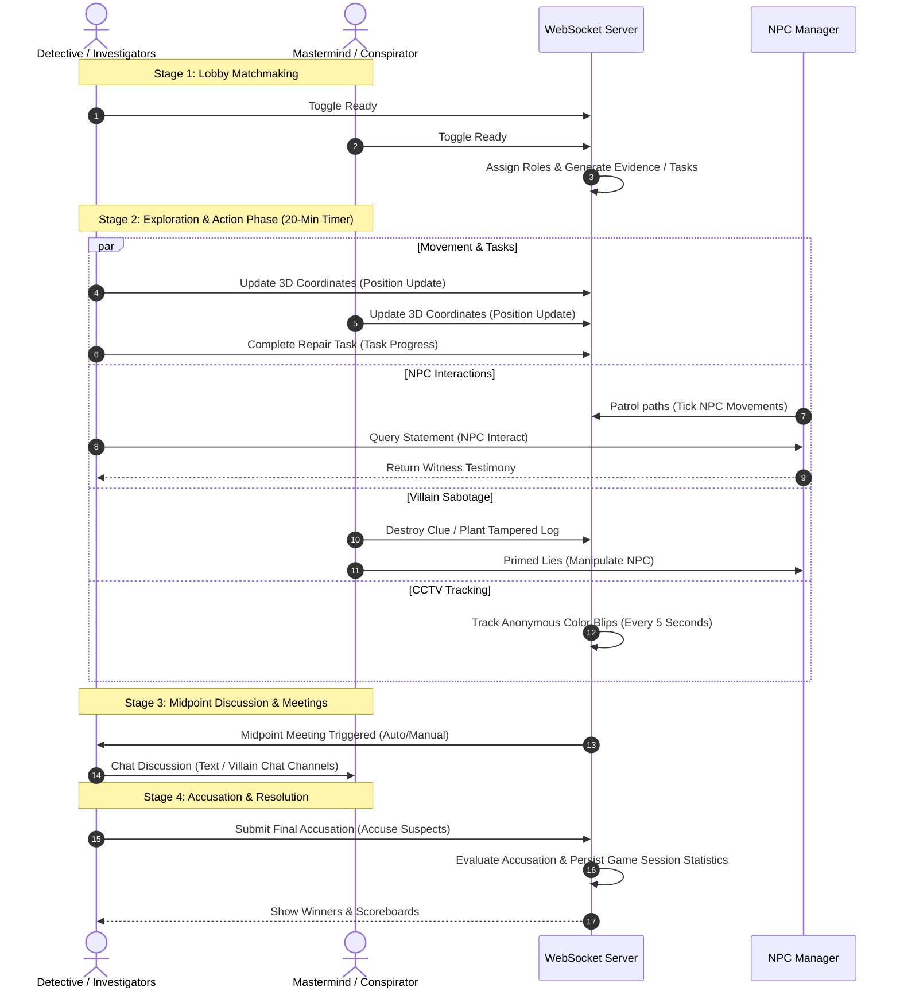
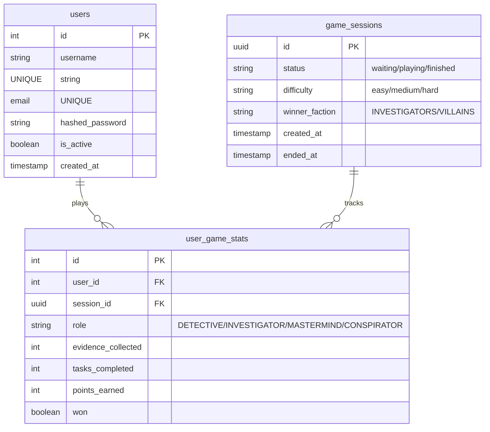

# 🕵️‍♂️ Campus Undercover: The Christ Mystery

A real-time multiplayer 3D social deduction and social investigation game set inside the **Christ University Central Campus** (Bengaluru). Built for a multiplayer experience, the game splits players into Investigators (led by a Detective) and Villains (a Mastermind and their Conspirator accomplice) as they race against time to solve or cover up a campus conspiracy.

The application leverages a high-performance **FastAPI** backend with asynchronous WebSockets, an immersive **React-Three-Fiber (Three.js)** 3D frontend, and a persistent **PostgreSQL** database.

---

## 🏗️ System Architecture

The game utilizes a stateful client-server design where real-time player positioning, NPC actions, and evidence collection are synchronized instantly via WebSockets:



---

## 🎮 Game Concept & Mechanics

### 🕵️ Role Dynamics

| Role | Faction | Primary Objective & Abilities |
| :--- | :--- | :--- |
| **Detective** | **Investigators** | Collect clues, view CCTV surveillance, correlate items on the Evidence Board, and accuse the culprits. <br>• *Abilities*: `CCTV_ANALYSIS`, `CORRELATE_EVIDENCE`, `DIGITAL_ANALYSIS`, `RECOVER_LOGS` |
| **Bystander / Investigator** | **Investigators** | Patrol the campus, complete support tasks, and report suspicious activities. <br>• *Tasks*: Repair network terminals, archive departmental records, test security hardware. |
| **Mastermind** | **Villains** | Coordinate the cover-up, manipulate campus witnesses, plant fake clues, and destroy incriminating evidence. <br>• *Abilities*: `DESTROY_EVIDENCE`, `PLANT_FAKE_EVIDENCE`, `MANIPULATE_NPC`, `TRIGGER_MEETING` |
| **Conspirator** | **Villains** | Act as the Mastermind's accomplice to confuse the Detective, plant fake evidence, frame innocent players, and block key perimeters. <br>• *Abilities*: `FRAME_PLAYER`, `SECURE_PERIMETER`, `CREATE_ALIBI` |

### 🔄 The Gameplay Loop



---

## 🌟 Core Features Implemented

### 1. Immersive 3D Campus Layout (React-Three-Fiber)
*   **Faithful Map Layout**: A complete digital twin of Christ University's Central Campus containing **24 custom-modeled locations** including the *Central Block*, *Audi Block*, *Computer Lab*, *Research Center*, *MCA Department*, *Sitting Areas*, *Hockey/Basketball Courts*, and *Hostels*.
*   **Intuitive Controls**: Implemented WASD keyboard movement, mouse camera yaw rotation, sprinting modifiers, and virtual joystick controllers for mobile-compatible browsers.
*   **Interactive Entities**: Live 3D rendering of spawned evidence assets, player character models, and patroling NPC models.

### 2. Autonomous NPC Patrol & Observation Engine
*   **16 Patroling NPCs**: Features realistic characters (e.g., *Dr. Priya Nair*, *Librarian Ms. Stella*, *Chef Murugan*) representing Students, Faculty, Security, and Staff with individual walk speeds, idle timers, and distinct patrol path configurations.
*   **Behavioral Observation Log**: NPCs maintain a memory log of player behaviors (e.g., collecting/destroying evidence) occurring within their observation radii.
*   **Lying & Manipulation Mechanics**: Villains can prime NPCs using `MANIPULATE_NPC` or `FRAME_PLAYER` to feed misleading testimonies to the Detective.

### 3. Server-Side Surveillance CCTV Tracker
*   **Anonymized Logs**: Tracks player coordinates every 5 seconds, mapping players to 10 distinct, anonymous color blips (`COLOR_MAP`) to prevent meta-gaming.
*   **Surveillance Logs**: Detectives visiting the *Security Office* can request a CCTV Analysis report for a specific location over a time window.
*   **Playback Minimap**: Generates path data for client-side playback.

### 4. Evidence Correlation & Board System
*   **Evidence Board GUI**: A premium, custom glassmorphic interface where the Detective organizes collected physical, digital, and testimonial evidence.
*   **Correlation Rules**: Detectives link evidence nodes. The server evaluates if the nodes converge on the same suspect and calculates connection strengths.
*   **Tampering Warnings**: Difficulty-scaled detection probabilities determine if the Detective intercepts warning notifications on fabricated logs planted by the villains.

---

## 📂 Project Structure

```text
campusgame/
├── docker-compose.yml         # Multi-container orchestrator configuration
├── backend/                   # FastAPI Python Server
│   ├── Dockerfile
│   ├── requirements.txt       # Python package dependencies
│   ├── alembic.ini            # Database migration configuration
│   ├── alembic/               # Database migration versions
│   │   └── versions/
│   │       └── b9a2f4653155_initial_schema.py
│   └── app/
│       ├── main.py            # WebSocket event loop and server entry point
│       ├── core/              # Global config and security controllers
│       ├── db/                # SQLAlchemy database connection models
│       │   ├── base.py
│       │   └── models/        # Schemas for users & game history
│       ├── schemas/           # Pydantic validation schemas
│       ├── api/               # Auth, Registration, and Lobby REST routes
│       └── game/              # State machines & logic modules
│           ├── lobby_manager.py       # Manages room creation and state
│           ├── role_service.py        # Assigns player roles randomly
│           ├── npc_manager.py         # Updates NPC patrol logs and AI state
│           ├── evidence_manager.py    # Spawns evidence points and fakes
│           ├── task_manager.py        # Handles Bystander task completion
│           ├── ability_manager.py     # Controls role ability execution
│           ├── cctv_service.py        # Tracks player history anonymously
│           ├── correlation_engine.py  # Connects evidence board inputs
│           └── resolution_service.py  # Evaluates win status and logs stats
└── frontend/                  # Vite + React + Three.js Client
    ├── Dockerfile
    ├── package.json           # Node scripts and UI dependencies
    ├── vite.config.js         # Hot-reloading dev configuration
    ├── index.html
    └── src/
        ├── main.jsx           # App wrapper and stylesheet inclusion
        ├── index.css          # Styling system (glassmorphism details)
        ├── App.jsx            # Loading animation, websocket router & screens
        ├── store/
        │   └── gameStore.js   # Zustand global game state variables
        ├── utils/             # Helper components & calculations
        └── components/
            ├── game/          # 3D canvas renderers (Three.js)
            │   ├── GameScene.jsx
            │   ├── CampusMap.jsx
            │   ├── Player.jsx
            │   ├── NPCCharacters.jsx
            │   ├── TaskZones.jsx
            │   └── EvidenceItems.jsx
            └── ui/            # Overlay menus (Z-index panels)
                ├── HomeScreen.jsx
                ├── RoleRevealScreen.jsx
                ├── GameHUD.jsx
                ├── EvidenceBoard.jsx
                ├── CCTVReportPanel.jsx
                ├── ChatPanel.jsx
                ├── AbilityMenu.jsx
                ├── MeetingScreen.jsx
                ├── AccusationScreen.jsx
                └── ResultsScreen.jsx
```

---

## 💾 Database Schema

The database uses PostgreSQL to save player registration credentials, active sessions, and historical game results.



---

## 🚀 Running the Application

### 🐳 Method A: Using Docker Compose (Recommended)

Spins up the complete environment including PostgreSQL, the FastAPI backend, and the Vite frontend.

```bash
# 1. Build and run containers in detached mode
docker-compose up --build -d

# 2. View streaming logs
docker-compose logs -f
```

*   **Frontend Client**: [http://localhost:5173](http://localhost:5173)
*   **Backend Server**: [http://localhost:8000](http://localhost:8000)
*   **API Interactive Documentation (OpenAPI)**: [http://localhost:8000/docs](http://localhost:8000/docs)

---

### 💻 Method B: Local Manual Execution

#### 1. Database Setup
Ensure PostgreSQL is running locally, create a database named `campusgame`, and update your environmental config files. Run migrations using Alembic:
```bash
cd backend
alembic upgrade head
```

#### 2. Running the Backend
1. Navigate to the backend folder:
   ```bash
   cd backend
   ```
2. Set up a virtual environment:
   ```bash
   python -m venv venv
   # On Windows:
   venv\Scripts\activate
   # On Unix/macOS:
   source venv/bin/activate
   ```
3. Install dependencies:
   ```bash
   pip install -r requirements.txt
   ```
4. Fire up the reload development server:
   ```bash
   uvicorn app.main:app --reload --port 8000
   ```

#### 3. Running the Frontend
1. Navigate to the frontend folder:
   ```bash
   cd frontend
   ```
2. Install npm packages:
   ```bash
   npm install
   ```
3. Boot the Vite dev server:
   ```bash
   npm run dev
   ```

---

## 📡 WebSocket API Protocols

Communication during gameplay occurs over JSON packets with the following standard types:

### 📤 Client-to-Server Messages
*   `POSITION_UPDATE` / `PLAYER_MOVE`: Broadcast coordinates to synchronize movement animations.
*   `COLLECT_EVIDENCE`: Interact with evidence models in the proximity.
*   `RECORD_MOVEMENT`: Anonymized track logs sent every 5 seconds.
*   `USE_ABILITY`: Submit requests to use detective/villain abilities.
*   `NPC_INTERACT`: Retrieve statements from a proximal NPC.
*   `TASK_PROGRESS`: Submit progression on active Bystander tasks.
*   `CHAT_MESSAGE`: Send text to `public` or `villain` channels.
*   `SUBMIT_ACCUSATION`: Detective's final accusation.

### 📥 Server-to-Client Messages
*   `ROLE_REVEAL`: Displays the private role card on match start.
*   `GAME_STATE`: Personal list of abilities, assigned tasks, and public evidence.
*   `PLAYER_MOVED` / `PLAYER_DISCONNECTED`: Synchronizes remote coordinates and gracefully handles reconnections.
*   `EVIDENCE_COLLECTED` / `EVIDENCE_APPEARED` / `EVIDENCE_DESTROYED`: Live updates of evidence availability.
*   `CCTV_REPORT`: Delivers anonymous colored presence timelines to the detective.
*   `CORRELATION_RESULT`: Analysis results from evidence links.
*   `MEETING_STARTED` / `MEETING_ENDED`: Halts exploration and displays chat dialog overlays.
*   `GAME_OVER`: Displays the winner panel, faction status, and scores.
