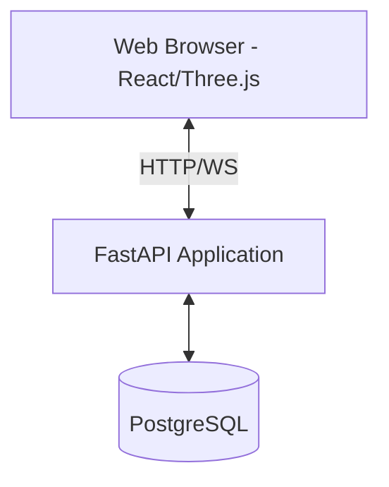

# Campus Undercover: The Christ Mystery

A real-time multiplayer 3D social deduction investigation game set inside Christ University's Central Campus. Built with a FastAPI backend (Python), Vite/React/Three.js frontend (JavaScript), and PostgreSQL database.

## System Architecture



## Running the Application

### Using Docker Compose (Recommended)

To build and spin up the complete stack:
```bash
docker-compose up --build
```
- Frontend: [http://localhost:5173](http://localhost:5173)
- Backend: [http://localhost:8000](http://localhost:8000)
- OpenAPI Docs: [http://localhost:8000/docs](http://localhost:8000/docs)

### Local Manual Execution

#### Backend Setup
1. Navigate to backend directory: `cd backend`
2. Create virtual environment: `python -m venv venv`
3. Activate virtual environment:
   - Windows: `venv\Scripts\activate`
   - Unix: `source venv/bin/activate`
4. Install dependencies: `pip install -r requirements.txt`
5. Run dev server: `uvicorn app.main:app --reload`

#### Frontend Setup
1. Navigate to frontend directory: `cd frontend`
2. Install dependencies: `npm install`
3. Run dev server: `npm run dev`
